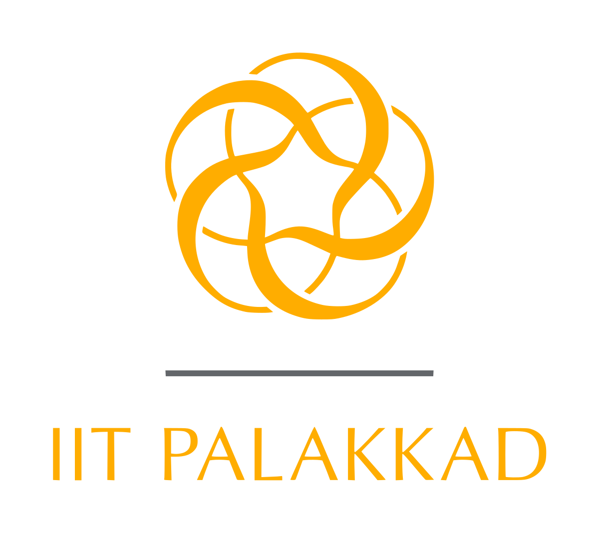



  

    <h2>Graduate Research Assistant | SVCL Lab</h2>
    
<b>Location</b>: UC San Diego, CA, USA

    
<b>Duration</b>: June 2023 - Present | 2 mos

    <h3>Responsibilites</h3>
    <ul>
        <li>Working on Accurate 3D-Hand Pose Estimation via Multi-Modal Fusion</li>
        <li>Researching multi-modal fusion techniques (sensor and image) to improve 3D hand pose estimation in highly occluded scenarios.</li>
        <li>Implementing an automated approach to annotate ground truths from multi-view cameras for training a transformer based architecture.</li>
    </ul>
  

  

    

      
    

  

  

    <h2>Graduate Research Assistant | Dr.Yuanyuan's Lab</h2>
    
<b>Location</b>: UC San Diego, CA, USA

    
<b>Duration</b>: Dec 2022 - Apr 2023 | 5 mos

    <h3>Responsibilites</h3>
    <ul>
        <li>Worked on Data-driven Smart Building Modeling</li>
        <li>Developed an efficient data storage system using PostgreSQL to organize and store temporal data, improving data access speed by automating table partitioning based on sensor IDs.</li>
        <li>Developed Python Flask APIs that connect to the database and retrieve data for a given time interval and registered users, while also developing a ReactJS-based frontend website with pages for registration and data retrieval.</li>
    </ul>
  

  

    

      
    

  

  

    <h2>Undergraduate Researcher</h2>
    
<b>Mentor</b>: Dr. Lakshmi Narasimhan

    
<b>Location</b>: IIT Palakkad, Kerala, India

    
<b>Duration</b>: Jan 2020 - Apr 2020 | 4 mos

    <h3>Responsibilites</h3>
    <ul>
        <li>Worked on developing Software Defined Radio for Visible Light Communication</li>
        <li> Developed an Open SDR to aid the research in visible light communication. The open source SDR invites people to experiment with the setup. We developed software using Python Tkinter and matplotlib to make a GUI for SDR and implemented a hardware model using LEDs and phototransistors.</li>
        <li>We were able to transfer data but with very low bit rates. Hence, we designed a more efficient model to increase the bit rates but couldn’t implement it because of Covid-19 restrictions.</li>
    </ul>
  

  

    

      
    

  

